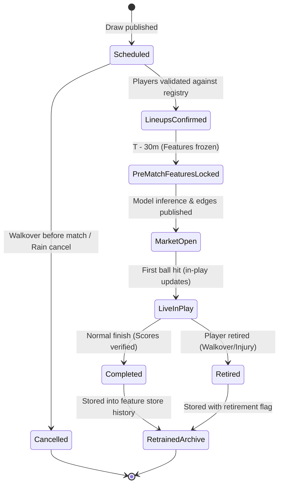

# ATP Real-Time Match Prediction Platform: System Specification & Architecture

A production blueprint for serving trained LightGBM and Regularized Logistic Regression models against real-time ATP tournament schedules and market odds feeds.

---

## 1. Executive Overview & System Topology

```
                                  [ Real-Time Data Providers ]
                    ┌─────────────────────────┴─────────────────────────┐
                    │                                                   │
             [ ATP Schedule & Live ]                             [ Bookmaker Odds ]
          (Sportradar / TennisData API)                       (The Odds API / Betfair)
                    │                                                   │
                    └─────────────────────────┬─────────────────────────┘
                                              ▼
                                 [ Ingestion & Normalizer ]
                                              │
                      ┌───────────────────────┴───────────────────────┐
                      ▼                                               ▼
          [ Match State Manager ]                           [ Odds De-Vig Engine ]
          - Tournament context                              - Multi-book aggregation
          - Player entity resolution                        - Margin removal (Power/Proportional)
          - Lifecycle state tracking                        - Implied probability $P_{\text{implied}}$
                      │                                               │
                      └───────────────────────┬───────────────────────┘
                                              ▼
                             [ Online Feature Compute Engine ]
                             - Historical store (2000–2026 DB)
                             - 28 Continuous delta features ($P_1 - P_2$)
                             - 3 Categorical / flag features
                             - Cold start resolver ($0.5$ baseline)
                                              │
                                              ▼
                                 [ Model Inference Service ]
                             - LGBM Champion ($M_{\text{LGBM}}$)
                             - LogReg Baseline ($M_{\text{LR}}$)
                             - Dual-pass symmetry enforcement
                                              │
                                              ▼
                                [ Edge & Staking Arbitrator ]
                             - Edge: $\Delta = P_{\text{model}} - P_{\text{implied}}$
                             - Half-Kelly criterion ($f^*$)
                             - Confidence & uncertainty gating
                                              │
                                              ▼
                                  [ Distribution Engine ]
                             - REST API (FastAPI)
                             - WebSocket Event Stream
                             - Static / Dynamic UI Client
```

---

## 2. Match Lifecycle & State Machine

Every fixture in the system progresses through a deterministic lifecycle:



### Invalidation & Cold-Start Rules
1. **Walkover prior to commencement**: Fixture discarded from feature rolling window to prevent spurious rest days.
2. **Retirements in-play**: Captured with `career_ret_freq_diff` and `med_ret_freq_diff` counters updated, but outcome excluded from game-spread aggregations.
3. **Player Entity Matching**: Fuzzy string resolution against ATP player IDs (e.g., `Alcaraz C.` $\leftrightarrow$ `Carlos Alcaraz Garfia`).

---

## 3. Online Feature Compute Engine (31 Predictors)

The engine receives `(Player_1, Player_2, Surface, Series, Date)` and computes the symmetric vector $\vec{X} \in \mathbb{R}^{31}$ in $< 15\,\text{ms}$.

### 3.1 Ranking & Momentum (2 Features)
- `rank_diff`: $\text{Rank}(P_1) - \text{Rank}(P_2)$ (Negative indicates $P_1$ is higher ranked).
- `pts_diff`: $\text{Points}(P_1) - \text{Points}(P_2)$.

### 3.2 Multi-Horizon Rolling Win Rates (17 Features)
Evaluated across 3 temporal horizons:
- **Short Horizon**: Last 10 finished matches.
- **Medium Horizon**: Last 365 calendar days ($52$ weeks).
- **Career Horizon**: All matches from 2000 to fixture timestamp.

| Feature Name | Horizon | Formula / Definition | Cold-Start Value |
| :--- | :--- | :--- | :--- |
| `short_winrate_diff` | 10 matches | $\Delta (\text{Wins} / \text{Matches})$ | $0.0$ |
| `short_tb_winrate_diff` | 10 matches | $\Delta (\text{TB Wins} / \text{TB Played})$ | $0.0$ |
| `short_comeback_rate_diff` | 10 matches | $\Delta (\text{Matches Won post set 1 loss} / \text{Sets 1 lost})$ | $0.0$ |
| `short_bb_rate_diff` | 10 matches | $\Delta (\text{Bagels [6-0] + Breadsticks [6-1]} / \text{Sets Won})$ | $0.0$ |
| `short_avg_games_per_set_diff` | 10 matches | $\Delta (\text{Total Games} / \text{Total Sets})$ | $0.0$ |
| `med_winrate_diff` | 365 days | $\Delta (\text{Wins} / \text{Matches})$ | $0.0$ |
| `med_tb_winrate_diff` | 365 days | $\Delta (\text{TB Wins} / \text{TB Played})$ | $0.0$ |
| `med_comeback_rate_diff` | 365 days | $\Delta (\text{Comeback Wins} / \text{Deficits})$ | $0.0$ |
| `med_bb_rate_diff` | 365 days | $\Delta (\text{Dominant Sets} / \text{Sets Won})$ | $0.0$ |
| `med_avg_games_per_set_diff` | 365 days | $\Delta (\text{Games} / \text{Sets})$ | $0.0$ |
| `med_ret_freq_diff` | 365 days | $\Delta (\text{Retirements} / \text{Matches Started})$ | $0.0$ |
| `career_winrate_diff` | Career | $\Delta (\text{Career Wins} / \text{Career Matches})$ | $0.0$ |
| `career_tb_winrate_diff` | Career | $\Delta (\text{Career TBs Won} / \text{Career TBs})$ | $0.0$ |
| `career_comeback_rate_diff` | Career | $\Delta (\text{Career Comebacks} / \text{Deficits})$ | $0.0$ |
| `career_bb_rate_diff` | Career | $\Delta (\text{Career Bagels/BB} / \text{Sets Won})$ | $0.0$ |
| `career_avg_games_per_set_diff`| Career | $\Delta (\text{Career Games} / \text{Career Sets})$ | $0.0$ |
| `career_ret_freq_diff` | Career | $\Delta (\text{Career Retirements} / \text{Matches})$ | $0.0$ |

### 3.3 Contextual & Fatigue (5 Features)
- `surface_winrate_diff`: Career win rate delta on specified court surface (Hard, Clay, Grass, Carpet).
- `days_since_last_diff`: $\text{DaysSinceLast}(P_1) - \text{DaysSinceLast}(P_2)$ (Positive means $P_1$ is more rested / rusty).
- `matches_14d_diff`: Match density over past 14 days (fatigue counter).
- `matches_30d_diff`: Match density over past 30 days (scheduling congestion).
- `form_divergence_diff`: $[(\text{WinRate}_{\text{short}, P_1} - \text{WinRate}_{\text{career}, P_1}) - (\text{WinRate}_{\text{short}, P_2} - \text{WinRate}_{\text{career}, P_2})]$.

### 3.4 Head-to-Head Record (4 Features)
- `h2h_winrate`: $\frac{\text{Wins}(P_1 \text{ vs } P_2)}{\text{Matches}(P_1 \text{ vs } P_2)}$ (Default $0.5$ if count $= 0$).
- `h2h_match_count`: Total prior encounters.
- `h2h_surface_winrate`: Prior win rate strictly on fixture surface (Default $0.5$ if count $= 0$).
- `h2h_surface_count`: Total encounters on current surface.

### 3.5 Context Categoricals & Flags (3 Features)
- `surface_encoded`: Integer mapping (`Clay`: 0, `Grass`: 1, `Hard`: 2, `Carpet`: 3).
- `series_encoded`: Tier index (`ATP250`: 0, `ATP500`: 1, `Masters 1000`: 2, `Grand Slam`: 3).
- `is_grand_slam`: Binary indicator ($1$ for Australian Open, Roland Garros, Wimbledon, US Open; $0$ otherwise).

---

## 4. Dual Model Serving & Inversion Symmetry

### 4.1 Symmetry Protocol
Binary prediction in tennis is invariant to order of entry. If model outputs $P(P_1 \text{ wins}) = \hat{y}$, swapping player identities must yield $1 - \hat{y}$.

To guarantee numerical symmetry:
$$\hat{P}_{\text{final}}(P_1) = \frac{M(\vec{X}_{P_1, P_2}) + (1 - M(\vec{X}_{P_2, P_1}))}{2}$$
Where $\vec{X}_{P_2, P_1} = -\vec{X}_{P_1, P_2}$ for all delta features.

### 4.2 Champion Model: LightGBM
- **Hyperparameters**: 162 estimators, learning rate $0.02$, `num_leaves: 31`, `min_child_samples: 40`, `subsample: 0.8`.
- **Validation Log-Loss**: $0.6149$ (Holdout 2024–2026), AUC: $0.7171$, Accuracy: $65.13\%$.
- **Latency Budget**: $< 8\,\text{ms}$ per evaluation.

### 4.3 Baseline Model: Regularized Logistic Regression
- **Pipeline**: `RobustScaler` (numeric deltas) + `OneHotEncoder` (surface/series) $\to$ `LogisticRegression(C=0.01, penalty='l2')`.
- **Purpose**: Sanity check anchor and linear divergence detector. If $|P_{\text{LGBM}} - P_{\text{LR}}| > 0.15$, trigger anomaly audit (flag non-linear interactions).

---

## 5. Market Edge & Staking Engine

### 5.1 Odds De-Vigorish (Consensus Fair Value)
Given raw bookmaker decimal odds $(O_1, O_2)$, compute raw implied probabilities $q_i = \frac{1}{O_i}$.
Bookmaker overround $S = q_1 + q_2 > 1.0$.

Power Method De-Vig:
$$q_1^{1/k} + q_2^{1/k} = 1.0 \implies P_{\text{implied}, 1} = q_1^{1/k}$$

### 5.2 Edge Quantification
$$\text{Edge}(P_1) = P_{\text{model}}(P_1) - P_{\text{implied}, 1}$$

- **Significant Value**: $\text{Edge} \ge +0.03$ ($+3.0\%$) and Model Confidence $> 0.55$.
- **Market Alignment**: $-0.02 < \text{Edge} < +0.02$ (Efficient market, no bet).
- **Negative Value**: $\text{Edge} \le -0.03$ (Bookmaker is pricing $P_1$ higher than fundamentals justify).

### 5.3 Staking Protocol (Fractional Kelly)
$$f^* = \max\left(0, \frac{b \cdot P_{\text{model}} - (1 - P_{\text{model}})}{b}\right) \times \kappa$$
Where $b = O_1 - 1$ (net decimal odds), and $\kappa = 0.25$ (Quarter-Kelly safety factor, max risk $2.5\%$ bankroll).

---

## 6. Real-Time Ingestion Pipeline & Architecture

### 6.1 Database Schema (PostgreSQL + TimescaleDB)

```sql
-- Tournaments & Fixtures
CREATE TABLE tournaments (
    id UUID PRIMARY KEY DEFAULT gen_random_uuid(),
    external_id VARCHAR(64) UNIQUE,
    name VARCHAR(128) NOT NULL,
    surface VARCHAR(16) NOT NULL, -- Hard, Clay, Grass, Carpet
    series VARCHAR(32) NOT NULL,  -- ATP250, ATP500, Masters 1000, Grand Slam
    is_grand_slam BOOLEAN DEFAULT FALSE,
    season INTEGER NOT NULL,
    start_date DATE NOT NULL,
    end_date DATE NOT NULL
);

CREATE TABLE fixtures (
    id UUID PRIMARY KEY DEFAULT gen_random_uuid(),
    tournament_id UUID REFERENCES tournaments(id),
    round VARCHAR(32) NOT NULL,
    player1_id UUID REFERENCES players(id),
    player2_id UUID REFERENCES players(id),
    scheduled_time TIMESTAMPTZ NOT NULL,
    status VARCHAR(24) NOT NULL, -- Scheduled, Warmup, Live, Finished, Retired, Walkover
    winner_id UUID REFERENCES players(id),
    score_string VARCHAR(64),
    created_at TIMESTAMPTZ DEFAULT NOW(),
    updated_at TIMESTAMPTZ DEFAULT NOW()
);

-- Feature Store Snapshot (Frozen at T-30m)
CREATE TABLE feature_snapshots (
    fixture_id UUID PRIMARY KEY REFERENCES fixtures(id),
    computed_at TIMESTAMPTZ NOT NULL,
    feature_vector JSONB NOT NULL, -- Array of 31 floats matching MODELING_PLAN
    p1_rank INTEGER,
    p2_rank INTEGER,
    h2h_total INTEGER,
    form_divergence FLOAT
);

-- Predictions & Market Odds Log
CREATE TABLE match_predictions (
    id UUID PRIMARY KEY DEFAULT gen_random_uuid(),
    fixture_id UUID REFERENCES fixtures(id),
    timestamp TIMESTAMPTZ NOT NULL,
    model_name VARCHAR(32) NOT NULL, -- LGBM_Champion, LR_Baseline
    p1_win_prob FLOAT NOT NULL,
    p2_win_prob FLOAT NOT NULL,
    raw_p1_odds FLOAT,
    raw_p2_odds FLOAT,
    devig_p1_prob FLOAT,
    edge_p1 FLOAT,
    recommended_kelly_fraction FLOAT
);
CREATE INDEX idx_predictions_fixture_ts ON match_predictions(fixture_id, timestamp DESC);
```

### 6.2 Redis Cache Structure
- `fixture:{fixture_id}:live`: Status, live score, current sets/games.
- `fixture:{fixture_id}:features`: 31-dim pre-computed numpy array.
- `fixture:{fixture_id}:prediction:latest`: JSON payload of dual model probs and odds edge.
- `player:{player_id}:rolling`: Pre-aggregated rolling stats (10m, 52w, career counters).

---

## 7. REST & WebSocket API Specification

### 7.1 REST Endpoints

#### `GET /api/v1/schedule/live`
Query active tournaments and fixtures for today.

#### `GET /api/v1/fixtures/{fixture_id}/features`
Inspect full 31 delta features breakdown with radar comparison.

### 7.2 WebSocket Stream (`ws://api/v1/stream/predictions`)
Pushes real-time feature re-calculations when odds move or matches finish:
```json
{
  "event": "ODDS_UPDATE",
  "fixture_id": "fix_9921",
  "timestamp": "2026-09-12T08:02:15Z",
  "bookmaker": "Pinnacle",
  "p1_odds": 2.25,
  "p2_odds": 1.68,
  "devig_p1": 0.428,
  "edge_p1": 0.057,
  "kelly_fraction": 0.046
}
```

---

## 8. Implementation Roadmap

```
[ Phase 1: Database & Entities ]  ──▶ [ Phase 2: Feature Store ]  ──▶ [ Phase 3: Model Serving ]
- Schemas & TimescaleDB setup          - Historical ETL (2000-2023)        - LightGBM & LogReg ONNX/C++
- Player canonical mapping              - Online feature calculation        - Dual-pass symmetry wrapper
- Match state machine                   - Cache invalidation (Redis)        - Latency benchmark (<15ms)
                                                                                       │
[ Phase 5: Monitoring & Drift ]   ◀── [ Phase 4: Frontend UI ]     ◀───────────────────┘
- Daily Brier score tracker             - Real-time tournament schedule
- Feature drift (PSI & KS tests)        - Value edge visualizer
- Automated model re-training           - Interactive 31-delta breakdown
```
